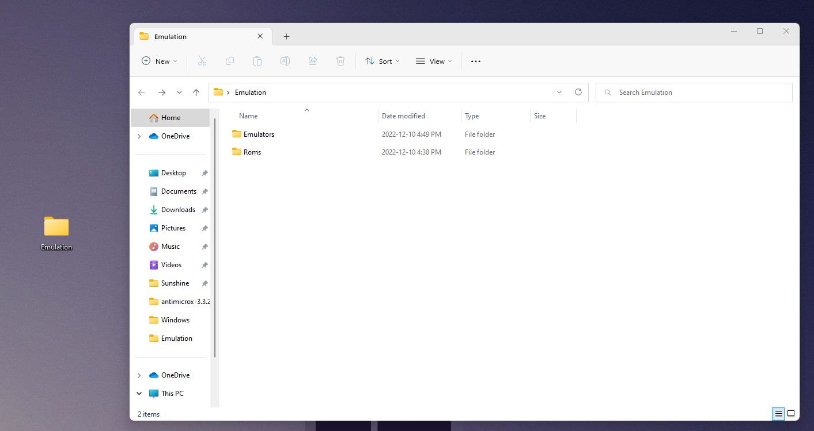
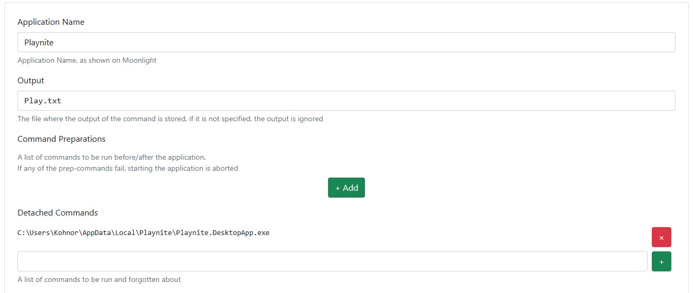
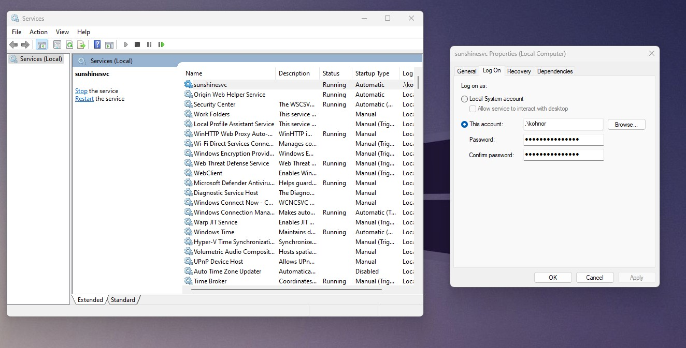
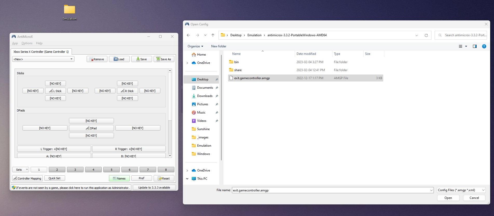
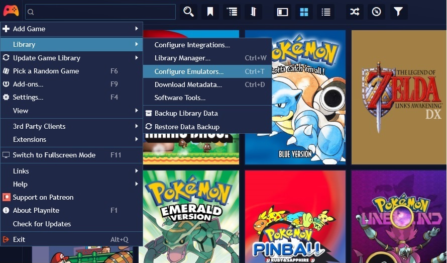
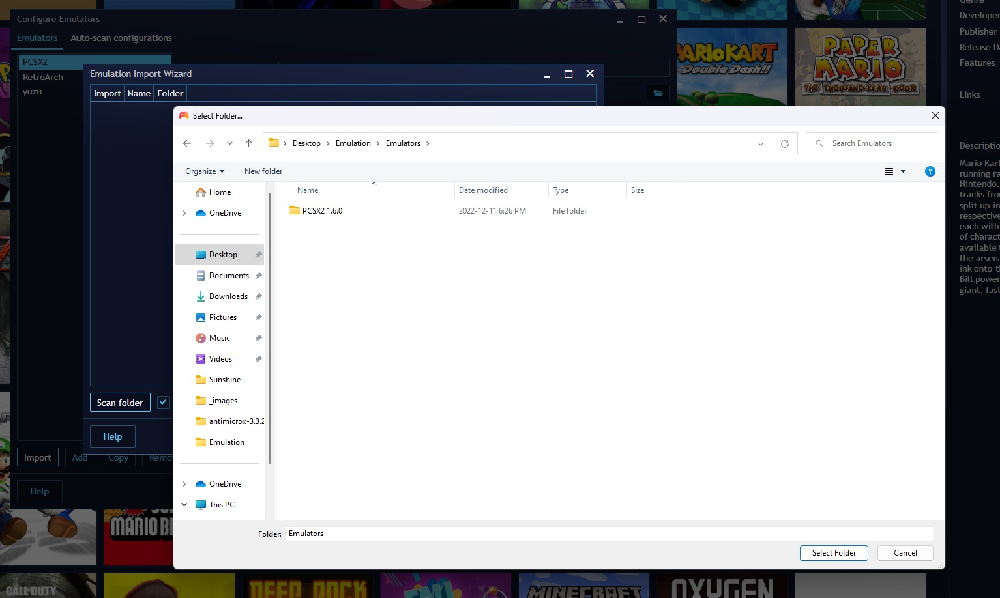
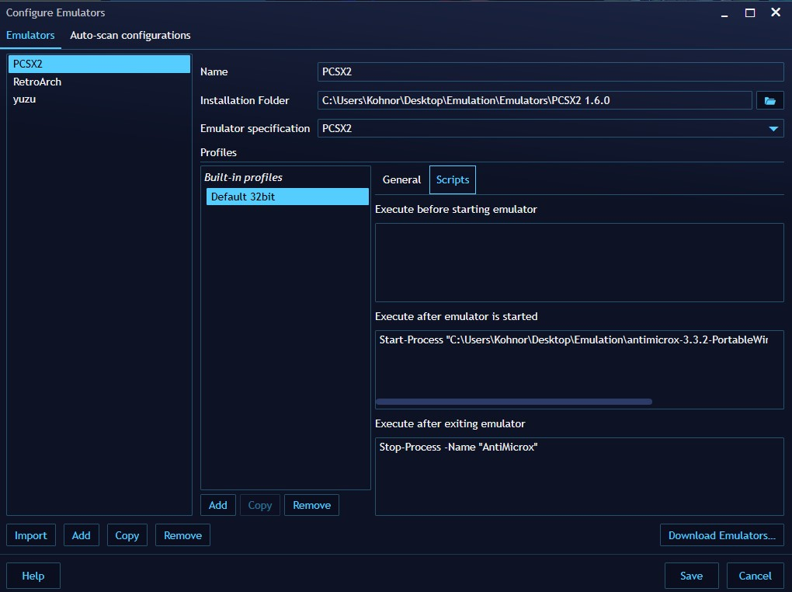

  

  LAN Cloud Gaming Setup by Kohnor Wrzosek

## Download Links

- [Sunshine](https://github.com/LizardByte/Sunshine/releases/tag/v0.17.0)
- [Playnite](https://playnite.link/)
- [RetroArch](https://www.retroarch.com/?page=platforms)
- [ViGem Driver for Xbox Controller](https://github.com/ViGEm/ViGEmBus/releases/download/v1.21.442.0/ViGEmBus_1.21.442_x64_x86_arm64.exe)
- [AntiMicroX](https://github.com/AntiMicroX/antimicrox)
- [MoonLight Download](https://moonlight-stream.org/#)

## Features

- Play video games over the Local Area Network
- Play on any device that can install the Moon Light App

## Tutorial

<strong>1:</strong>
Create a folder on your desktop called Emulation and create two folders "Roms" and "Emulators" inside that folder.
  

<strong>2:</strong>
Place the antimicrox folder you downloaded in the Emulation folder.

<strong>3:</strong>
Run and install Sunshine. Once installed, run the application. Go to the link provided from the CMD window.
Create a new username and password for sunshine.

<strong>4:</strong>
Install Moonlight on your device. On your computer, open CMD and type <strong>ipconfig</strong> and press enter. Note your I.P address.

<strong>5:</strong>
In the Moonlight app, your computer might show up. If not, click on "Add Host Manually". Type in your I.P address and click ok.

<strong>6:</strong>
Back on the Sunshine webpage, click on "PIN". Type the PIN that Moonlight gives you. Click send when you're done. Moonlight will be setup for your computer.

<strong>7:</strong>
On the Sunshine webpage, click on "Applications". Click on Add New. Open CMD and type <strong>whoami</strong>. Put your username in C:\Users<strong>\InsertUsernameHere</strong>\\AppData\Local\Playnite\Playnite.DesktopApp.exe</strong> like so. Then click save on the bottom screen.
  

<strong>8:</strong>
We have to set the sunshine service to run as your local user. In Windows search, search for services.  Find the sunshinevc service. Right click and click properties. click Log on, then click on the This account radio button and browse. Type your username in and click check name. Once done, it will look like the image below and click apply and ok.
  

<strong>9:</strong>
It's time to setup Antimicrox. Head to the bin folder in the Antimicrox folder and open antimicrox.exe. Make sure it's located in your emulation folder. <strong>This is very important!</strong> <a id="raw-url" href="./_config/exit.gamecontroller.amgp">Download this config file and place it in the Antimicrox folder.</a> Now we have to link the config file. Make sure you have a controller connected to your computer or connected to your device through Moonlight and connect to the computer through Moonlight. Click on load and select the exit config. Now when you press select once, and down on the d-pad it will exit PS2 and Switch games.
  

<strong>10:</strong>
It's time to set up Playnite. Head to Configure Emulators   
  
Click import, Scan folder, and goto the emulators folder in emulation. This will scan the emulators in the folder.

  
Once added, click on the emulator that uses ESC to exit the emulator. Click Default 32bit then Scripts. Copy these commands and paste them like in the screenshot and click save.

- Start-Process "C:\Users<strong>\InsertUsernameHere</strong>\\Desktop\Emulation<strong>\Antimicroxfolder</strong>\bin\antimicrox.exe"

- Stop-Process -Name "AntiMicrox"

<strong>11:</strong>
Congratulations! You're done. Put Playnite in Fullscreen Mode by pushing F11 and enjoy!